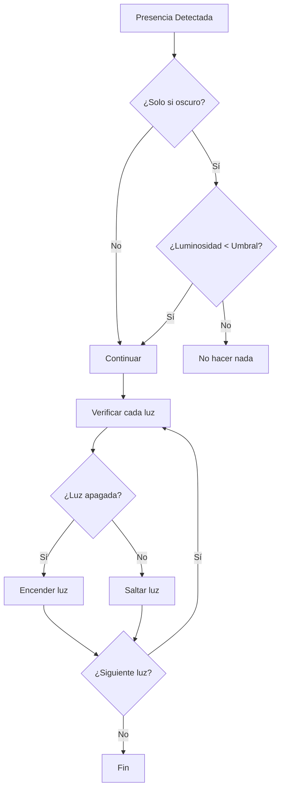
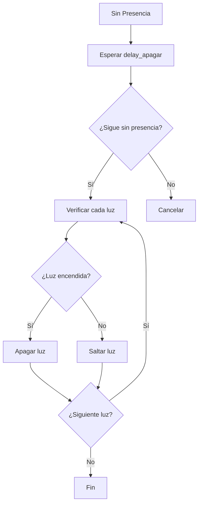

# SmartNode - Control Multi-Luz por Presencia

## 📋 Descripción

Blueprint para automatización de múltiples luces basado en detección de presencia y nivel de luminosidad usando un SmartNode con sensor LD2410.

## ✨ Características

- ✅ **Control de múltiples luces simultáneamente**
- ✅ **Enciende solo luces apagadas** al detectar presencia
- ✅ **Apagado automático** configurable tras ausencia
- ✅ **Respeta condición de oscuridad** (opcional y configurable)
- ✅ **Límite de distancia de detección** (opcional, 0-10m)
- ✅ **Soporte para switches y luces con dimmer**
- ✅ **Umbrales y delays totalmente configurables**
- ✅ **Transiciones suaves** al encender/apagar
- ✅ **Logs detallados** en el Logbook

## 🎯 Casos de Uso

### Caso 1: Dormitorio
- SmartNode detecta presencia al entrar
- Si está oscuro (≤30%), enciende lámpara de noche y luz del techo al 50%
- Al salir, espera 60s y apaga ambas luces

### Caso 2: Baño
- SmartNode detecta presencia
- Enciende luz principal y espejo
- Al salir, espera 30s y apaga todo

### Caso 3: Pasillo
- SmartNode detecta movimiento
- Si está oscuro, enciende luces del pasillo al 40%
- Apaga después de 45s sin movimiento

## 📦 Instalación

### 1. Copiar Blueprint a Home Assistant

```bash
# Desde el repositorio
cp blueprints/smartnode_multi_light_presence.yaml \
   /config/blueprints/automation/smartnode/
```

O manualmente:
1. Ir a **Configuración → Automatizaciones y Escenas → Blueprints**
2. Hacer clic en **Importar Blueprint**
3. Pegar la URL:
   ```
   https://github.com/mauitz/home-assistant-blueprints/blob/main/blueprints/smartnode_multi_light_presence.yaml
   ```

### 2. Verificar que el SmartNode esté funcionando

Asegúrate de tener las siguientes entidades del SmartNode:

```yaml
# Sensor de presencia (obligatorio)
binary_sensor.smartnode1_presence

# Sensor de luminosidad (obligatorio)
sensor.smartnode1_room_brightness

# Sensor de distancia de detección (opcional)
sensor.smartnode1_detection_distance
```

## ⚙️ Configuración

### Parámetros Obligatorios

| Parámetro | Descripción | Tipo |
|-----------|-------------|------|
| **Sensor de Presencia** | Sensor de presencia del SmartNode | `binary_sensor` |
| **Sensor de Luminosidad** | Sensor de luminosidad del SmartNode (%) | `sensor` |
| **Luces/Switches** | Luces o switches a controlar | `light` o `switch` (múltiple) |

### Parámetros Opcionales

| Parámetro | Descripción | Default | Rango |
|-----------|-------------|---------|-------|
| **Sensor de Distancia** | Sensor de distancia de detección del SmartNode | `""` (vacío) | `sensor` |
| **Nivel de Brillo** | % de brillo al encender (solo dimmers) | 80% | 1-100% |
| **Tiempo de Transición** | Segundos de transición al encender/apagar | 1s | 0-10s |
| **Umbral de Oscuridad** | % por debajo del cual se considera oscuro | 30% | 0-100% |
| **Solo Cuando Está Oscuro** | Activar solo si está oscuro | `true` | boolean |
| **Distancia Máxima de Detección** | Distancia máxima en metros (0 = sin límite) | 0m | 0-10m |
| **Delay al Encender** | Segundos antes de encender (anti falsos positivos) | 0s | 0-30s |
| **Delay al Apagar** | Segundos tras ausencia para apagar | 60s | 5-600s |
| **Habilitar Logs** | Registrar eventos en Logbook | `true` | boolean |

## 🚀 Uso

### Ejemplo 1: Dormitorio - SmartNode1

**Configuración:**
```yaml
Sensor de Presencia: binary_sensor.smartnode1_presence
Sensor de Luminosidad: sensor.smartnode1_room_brightness
Sensor de Distancia: sensor.smartnode1_detection_distance
Luces/Switches:
  - light.lampara_noche_dormitorio
  - light.luz_techo_dormitorio
  - light.lampara_escritorio
Nivel de Brillo: 60%
Umbral de Oscuridad: 30%
Solo Cuando Está Oscuro: Sí
Distancia Máxima de Detección: 3m  # ← Solo enciende si estás a menos de 3m
Delay al Apagar: 60s
```

**Comportamiento:**
- Al entrar al dormitorio de noche (≤3m del sensor) → Enciende las 3 luces al 60%
- Si detecta presencia >3m → No hace nada (evita encender al pasar por el pasillo)
- Al salir del dormitorio → Espera 60s y apaga las 3 luces
- Durante el día (>30% luminosidad) → No hace nada

### Ejemplo 2: Baño - Funcionamiento 24/7

**Configuración:**
```yaml
Sensor de Presencia: binary_sensor.smartnode_bano_presence
Sensor de Luminosidad: sensor.smartnode_bano_room_brightness
Luces/Switches:
  - light.luz_bano_principal
  - light.espejo_bano
Nivel de Brillo: 100%
Solo Cuando Está Oscuro: No  # ← Funciona siempre
Delay al Apagar: 30s
```

**Comportamiento:**
- Al entrar al baño (día o noche) → Enciende las 2 luces
- Al salir → Espera 30s y apaga

### Ejemplo 3: Pasillo - Luz Tenue

**Configuración:**
```yaml
Sensor de Presencia: binary_sensor.smartnode_pasillo_presence
Sensor de Luminosidad: sensor.smartnode_pasillo_room_brightness
Luces/Switches:
  - light.pasillo_1
  - light.pasillo_2
  - light.pasillo_3
Nivel de Brillo: 40%
Umbral de Oscuridad: 40%  # ← Más sensible
Delay al Encender: 1s  # ← Evita activaciones al pasar rápido
Delay al Apagar: 45s
```

## 🔧 Funcionamiento Interno

### Flujo de Encendido



### Flujo de Apagado



## 📊 Logs en Logbook

Con logs habilitados, verás eventos como:

### Sin Límite de Distancia
```
🏠 SmartNode Multi-Light
Presencia detectada
Luminosidad: 18%
Umbral: 30%
Luces configuradas: 3

💡 SmartNode Multi-Light
Encendida: Lámpara Noche Dormitorio

💡 SmartNode Multi-Light
Encendida: Luz Techo Dormitorio

💡 SmartNode Multi-Light
Encendida: Lámpara Escritorio

✅ SmartNode Multi-Light
Total encendidas: 3 luz(es)

---

🌙 SmartNode Multi-Light
Ausencia detectada (60s)
Verificando luces a apagar...

🔌 SmartNode Multi-Light
Apagada: Lámpara Noche Dormitorio

✅ SmartNode Multi-Light
Total apagadas: 3 luz(es)
```

### Con Límite de Distancia
```
🏠 SmartNode Multi-Light
Presencia detectada
Luminosidad: 18%
Umbral: 30%
Distancia: 2.4m (máx: 3m)
Luces configuradas: 3

💡 SmartNode Multi-Light
Encendida: Lámpara Noche Dormitorio

✅ SmartNode Multi-Light
Total encendidas: 3 luz(es)
```

## 📏 Límite de Distancia de Detección

### ¿Para qué sirve?

El límite de distancia permite activar las luces **solo si la persona está cerca del sensor**, evitando activaciones no deseadas cuando alguien pasa por una zona adyacente.

### Casos de Uso

#### Caso 1: Dormitorio con puerta cerca del pasillo
```
🚪 Puerta ← 2m → 🛏️ Cama ← 1m → 📡 SmartNode
```

**Problema:** El sensor detecta personas en el pasillo (4-5m) y enciende luces innecesariamente.

**Solución:** Configurar `Distancia Máxima: 3m`
- ✅ Enciende al entrar a la habitación (≤3m)
- ❌ No enciende al pasar por el pasillo (>3m)

#### Caso 2: Baño con sensor muy sensible
```
🚽 Baño ← 1.5m → 📡 SmartNode ← 1m → 🚪 Puerta
```

**Problema:** El sensor LD2410 detecta hasta 6m, incluyendo el pasillo exterior.

**Solución:** Configurar `Distancia Máxima: 2.5m`
- ✅ Enciende solo al entrar al baño
- ❌ No enciende cuando alguien está en el pasillo

### Configuración

```yaml
# Sin límite de distancia (default)
Distancia Máxima de Detección: 0m

# Con límite de distancia
Sensor de Distancia: sensor.smartnode1_detection_distance
Distancia Máxima de Detección: 3m
```

### Valores Recomendados

| Habitación | Distancia Recomendada | Razón |
|------------|----------------------|-------|
| **Dormitorio pequeño** | 2-3m | Evita detección desde pasillo |
| **Dormitorio grande** | 4-5m | Permite detección en toda la habitación |
| **Baño** | 2-3m | Solo detectar dentro del baño |
| **Pasillo** | 0m (sin límite) | Queremos detectar en todo el pasillo |
| **Cocina** | 3-4m | Zona de trabajo cerca del sensor |

## 🆚 Comparación con Blueprint Original

| Característica | smartnode_presence_lighting.yaml | smartnode_multi_light_presence.yaml |
|----------------|----------------------------------|-------------------------------------|
| **Número de luces** | 1 luz | Múltiples luces ✅ |
| **Control de brillo** | Sí | Sí |
| **Condición de oscuridad** | Obligatoria | Opcional ✅ |
| **Límite de distancia** | No | Sí (0-10m) ✅ |
| **Tracking de luces** | No | Sí (solo afecta luces apagadas) ✅ |
| **Logs detallados** | Básicos | Completos ✅ |
| **Notificaciones** | Sí | No (simplificado) |

## 🐛 Troubleshooting

### Las luces no se encienden

**Verificar:**
1. ¿El sensor de presencia está funcionando?
   ```bash
   # Ver estado
   ha-cli state get binary_sensor.smartnode1_presence
   ```

2. ¿La luminosidad está por debajo del umbral?
   ```bash
   # Ver luminosidad actual
   ha-cli state get sensor.smartnode1_room_brightness
   ```

3. ¿Está habilitado "Solo Cuando Está Oscuro" pero hay luz?
   - Deshabilitar la opción o ajustar el umbral

### Las luces se encienden y apagan constantemente

**Solución:** Aumentar el `Delay al Encender` a 2-3 segundos para evitar falsos positivos del sensor LD2410.

### Las luces no se apagan

**Verificar:**
1. ¿El sensor de presencia sigue detectando movimiento?
2. ¿El `Delay al Apagar` es muy corto?
   - Aumentar a 60s o más

### Solo algunas luces se encienden

**Causa:** Las luces ya estaban encendidas. El blueprint solo enciende luces que estaban apagadas al detectar presencia.

**Solución esperada:** Esto es por diseño. Si quieres que todas las luces se enciendan siempre, necesitas apagarlas manualmente primero.

### Las luces no se encienden aunque hay presencia

**Posibles causas:**

1. **Distancia muy corta configurada**
   ```bash
   # Verificar distancia actual
   ha-cli state get sensor.smartnode1_detection_distance
   # Resultado: 4.2m
   ```
   - Si el límite es 3m y detecta a 4.2m → No enciende
   - **Solución:** Aumentar `Distancia Máxima` o poner 0 (sin límite)

2. **Sensor de distancia no configurado**
   - Si configuras `Distancia Máxima: 3m` pero no seleccionas el sensor de distancia → Error
   - **Solución:** Seleccionar `Sensor de Distancia` o poner `Distancia Máxima: 0`

## 🔄 Modo de Ejecución

El blueprint usa `mode: restart`, lo que significa:

- Si se detecta presencia mientras está ejecutándose → **Se reinicia** el proceso
- Si se pierde presencia → Se inicia el contador de apagado
- Si se detecta presencia de nuevo antes de apagar → **Se cancela** el apagado

Esto previene apagados accidentales cuando hay presencia intermitente.

## 📝 Notas Adicionales

### Compatibilidad

- ✅ **Luces con dimmer** (controla brillo)
- ✅ **Luces simples on/off** (ignora configuración de brillo)
- ✅ **Switches** (trata como on/off)
- ✅ **Grupos de luces** (funciona perfectamente)

### Consumo de Energía

Con transiciones de 1s y apagado automático, este blueprint ayuda a:
- Reducir consumo de energía innecesario
- Prolongar vida útil de las bombillas
- Mantener automatización fluida y natural

### Mejores Prácticas

1. **Ajusta el umbral de oscuridad** según cada habitación
   - Dormitorios: 25-30%
   - Baños: 20-25%
   - Pasillos sin ventanas: 40-50%

2. **Configura delays apropiados**
   - Baños: 30-60s
   - Dormitorios: 60-120s
   - Pasillos: 30-45s

3. **Usa límite de distancia** cuando sea necesario
   - Dormitorios cerca de pasillos: 2-3m
   - Baños con sensor muy sensible: 2-3m
   - Habitaciones grandes: 4-5m
   - Sin límite (0m) para pasillos y áreas abiertas

4. **Usa grupos de luces** para simplificar configuración
   ```yaml
   light:
     - platform: group
       name: Luces Dormitorio
       entities:
         - light.lampara_noche
         - light.luz_techo
   ```

## 🔗 Referencias

- [Documentación SmartNode](./README.md)
- [Blueprint Original](../../blueprints/smartnode_presence_lighting.yaml)
- [Ejemplos de Configuración](../../examples/smartnode_multi_light_config.yaml)

## 📄 Licencia

MIT - Libre para uso personal y comercial

---

**Creado por:** PezAustral
**Repositorio:** https://github.com/mauitz/home-assistant-blueprints
**Versión:** 1.0.0
**Fecha:** Enero 2026

